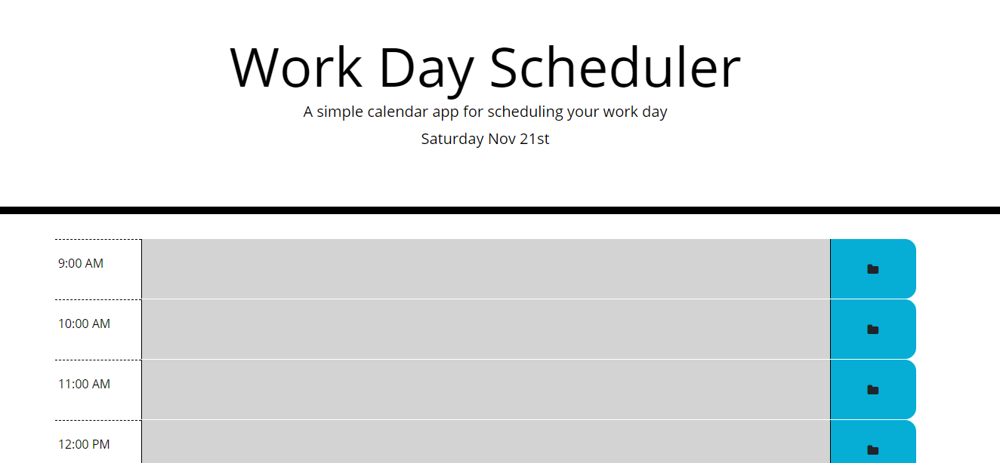

# Day_Planner

This aplication uses Moment.js to update the page with the current day and time. The Day Planner App contains timeblocks from 9:00am till 5:00pm. The timeblocks background colors are updated relative to the current time. Timeblocks that have passed are colored grey, the current timeblock is colored red, and future timeblocks are colored green. 

The user may click on any timeblock to add events. When the save button is clicked the event for
that timeblock is saved to local storage. When the application is reloaded these events are pulled from storage and displayed appropriatly. 

Tools used:
1. JavaScript
2. HTMl
3. CSS

 https://heathw24.github.io/Day_Planner/

 